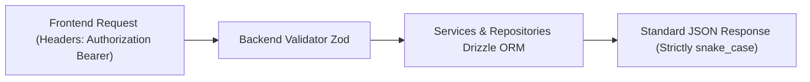
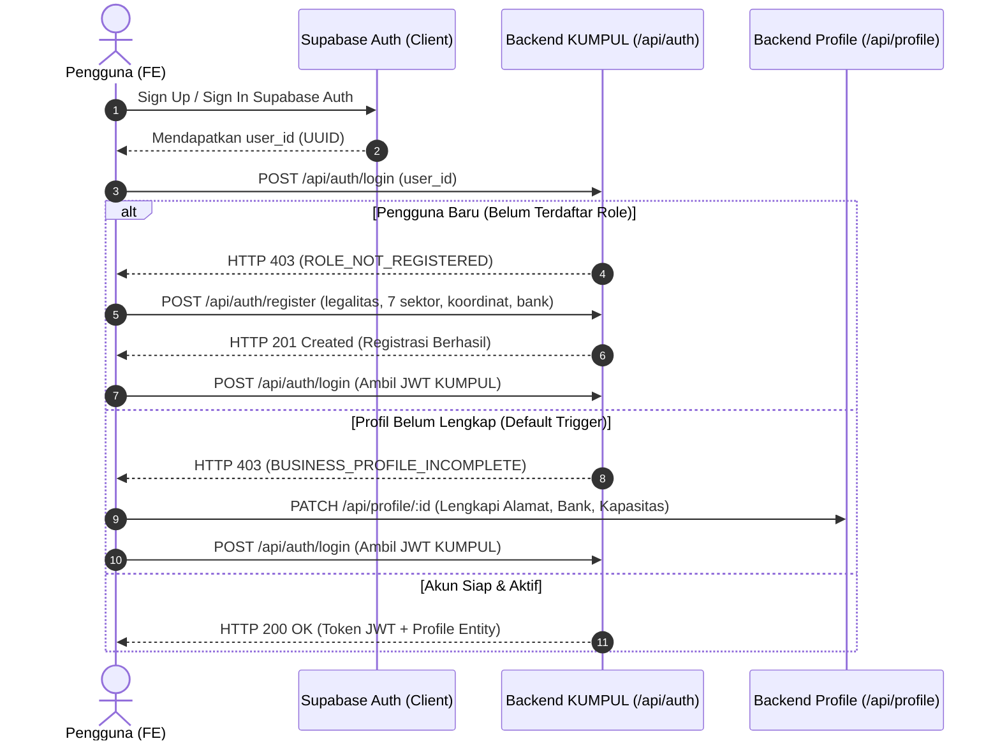
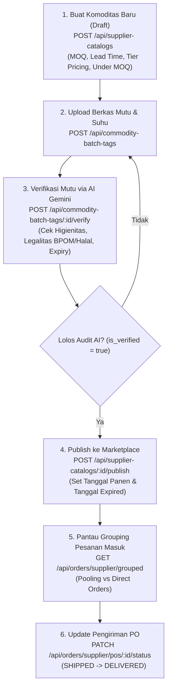
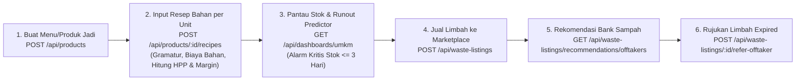
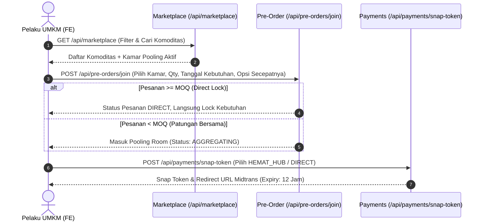
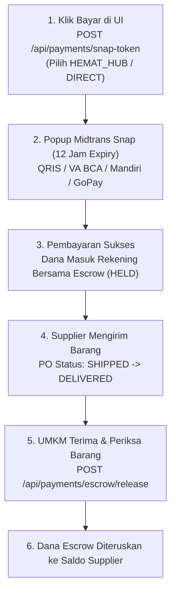

# PANDUAN LENGKAP INTEGRASI FRONTEND (FE) KUMPUL
## Alur Bisnis, Interaksi UI, Spesifikasi Endpoint, Request & Response (Supplier & UMKM)

Dokumen ini disusun sebagai acuan kerja bagi tim **Frontend Developer (FE)** dalam mengintegrasikan antarmuka aplikasi dengan Backend API **KUMPUL**. Panduan ini mencakup seluruh siklus operasional: dari registrasi 7 sektor, kelengkapan rekening Midtrans, katalogisasi dan uji mutu AI, grouping pesanan supplier, resep dan HPP UMKM, bursa limbah & bank sampah terdekat, hingga patungan pre-order (pooling) MOQ dan escrow pembayaran.

---

## DAFTAR ISI
1. [Standar & Konvensi Global Frontend](#1-standar--konvensi-global-frontend)
2. [Fase 1: Autentikasi & Onboarding Profil (Supplier & UMKM)](#2-fase-1-autentikasi--onboarding-profil-supplier--umkm)
3. [Fase 2: Alur Lengkap Supplier (Hulu Pasokan)](#3-fase-2-alur-lengkap-supplier-hulu-pasokan)
4. [Fase 3: Alur Lengkap UMKM (Produksi, Resep, Stok & Limbah)](#4-fase-3-alur-lengkap-umkm-produksi-resep-stok--limbah)
5. [Fase 4: Sistem Marketplace & Pre-Order Pooling MOQ](#5-fase-4-sistem-marketplace--pre-order-pooling-moq)
6. [Fase 5: Pembayaran Midtrans Snap & Rekening Bersama (Escrow)](#6-fase-5-pembayaran-midtrans-snap--rekening-bersama-escrow)
7. [Tabel Cheatsheet Error Code & Penanganan UI](#7-tabel-cheatsheet-error-code--penanganan-ui)

---

## 1. Standar & Konvensi Global Frontend



### 1.1. Base URL & Header Autentikasi
* **Local Development Base URL:** `http://localhost:3000`
* **Production Base URL:** Sesuai domain deployment Vercel (misal: `https://kumpul-be.vercel.app`)
* **Headers Wajib (Endpoint Terproteksi):**
  ```http
  Authorization: Bearer <token_jwt_kumpul>
  Content-Type: application/json
  ```

### 1.2. Format JSON snake_case
Seluruh parameter request body, query params, dan properti response JSON **100% menggunakan format `snake_case`**. Frontend tidak diperkenankan menggunakan format `camelCase` saat mengirim payload.

### 1.3. Struktur Standar Respons API
Setiap response API dari server selalu dibungkus dalam format terstandarisasi:

**Respons Sukses (HTTP 200 / 201):**
```json
{
  "status": "success",
  "message": "Pesan deskriptif keberhasilan",
  "data": { ... }
}
```

**Respons Error Terpusat (HTTP 400 / 401 / 403 / 404 / 500):**
```json
{
  "status": "error",
  "error_code": "ERROR_CODE_TERDEFINISI",
  "message": "Pesan human-readable untuk ditampilkan di banner / modal / toast UI",
  "error_details": [
    {
      "field": "nama_kolom",
      "issue": "Keterangan detail kendala validasi"
    }
  ]
}
```

---

## 2. Fase 1: Autentikasi & Onboarding Profil (Supplier & UMKM)



### 2.1. Login / Token Exchange
* **Endpoint:** `POST /api/auth/login`
* **Kapan Dipanggil:** Setiap kali user berhasil login via Supabase Auth pada frontend untuk menukarkan `user_id` dengan JWT resmi KUMPUL.
* **Request Body:**
  ```json
  {
    "user_id": "4743cee5-d6bc-4ff0-8c7d-f709c7d7db3b",
    "role": "UMKM"
  }
  ```
  *(Catatan: field `role` bersifat opsional; jika akun memiliki multi-role, kirimkan role yang aktif dipilih).*

* **Respons Sukses (HTTP 200):**
  ```json
  {
    "status": "success",
    "message": "Login pengguna berhasil",
    "data": {
      "token": "eyJhbGciOiJIUzI1NiIsInR5cCI6IkpXVCJ9...",
      "user_id": "4743cee5-d6bc-4ff0-8c7d-f709c7d7db3b",
      "entity_id": "8fa11111-2222-3333-4444-555555555555",
      "active_role": {
        "id": "e0000001-aaaa-bbbb-cccc-dddddddddddd",
        "role_type": "UMKM",
        "sector_type": "FNB_PENGOLAHAN"
      },
      "business_entity": {
        "id": "8fa11111-2222-3333-4444-555555555555",
        "legal_name": "Dapur Rasa Makmur",
        "profile_picture_url": "https://storage.kumpul.id/profiles/dapur-rasa.jpg"
      }
    }
  }
  ```

* **Penanganan Kasus Error (PENTING UNTUK FE NAVIGATION):**
  1. **Jika `error_code == "ROLE_NOT_REGISTERED"` (HTTP 403):**
     Artinya pengguna baru mendaftar di Supabase Auth tapi belum mendaftarkan entitas bisnisnya di KUMPUL. FE harus langsung me-redirect pengguna ke halaman **Form Pendaftaran Usaha (Onboarding)**.
  2. **Jika `error_code == "BUSINESS_PROFILE_INCOMPLETE"` (HTTP 403):**
     Artinya data koordinat lokasi atau nama usaha masih bernilai default. Arahkan pengguna ke halaman **Lengkapi Data Usaha**.

---

### 2.2. Registrasi Profil Usaha & Pemilihan 7 Sektor
* **Endpoint:** `POST /api/auth/register`
* **Kapan Dipanggil:** Pada halaman pendaftaran usaha setelah user login Supabase Auth pertama kali.
* **Ketentuan Role:** `'SUPPLIER'` atau `'UMKM'`.
* **Ketentuan 7 Sektor:** Wajib memilih salah satu dari 7 sektor terstandarisasi:
  `'PERTANIAN'`, `'PETERNAKAN'`, `'PERIKANAN'`, `'PERKEBUNAN'`, `'FNB_PENGOLAHAN'`, `'RITEL'`, `'LOGISTIK'`.
* **Request Body:**
  ```json
  {
    "user_id": "4743cee5-d6bc-4ff0-8c7d-f709c7d7db3b",
    "role": "UMKM",
    "sector": "FNB_PENGOLAHAN",
    "legal_name": "Dapur Rasa Makmur",
    "npwp_nib": "9381029381029381",
    "default_address": "Jl. Gejayan No. 25, Sleman, DI Yogyakarta",
    "latitude": -7.76512,
    "longitude": 110.38914,
    "bank_account_info": {
      "bank_name": "BCA",
      "account_number": "8830192831",
      "account_holder": "Dapur Rasa Makmur"
    },
    "profile_picture_url": "https://storage.kumpul.id/profiles/dapur-rasa.jpg",
    "storage_capacity": 500
  }
  ```
* **Respons Sukses (HTTP 201):**
  ```json
  {
    "status": "success",
    "message": "Registrasi role dan profil bisnis pengguna berhasil",
    "data": {
      "user_id": "4743cee5-d6bc-4ff0-8c7d-f709c7d7db3b",
      "entity_id": "8fa11111-2222-3333-4444-555555555555",
      "role": "UMKM",
      "sector": "FNB_PENGOLAHAN"
    }
  }
  ```
  *Setelah request ini berhasil (201), FE otomatis mengeksekusi `POST /api/auth/login` untuk mendapatkan JWT token dan menyimpan token ke local storage / cookie.*

---

### 2.3. Melengkapi & Mengedit Profil (Rekening Midtrans & Kapasitas Simpan)
* **Endpoint Detail:** `GET /api/profile/:id` (Headers: `Authorization: Bearer <token>`)
* **Endpoint Update:** `PATCH /api/profile/:id` atau `PUT /api/profile/:id`
* **Fallback Logo KUMPUL:** Jika pengguna belum mengunggah gambar profil, backend secara otomatis memberikan default URL logo resmi KUMPUL (`/assets/kumpul-logo.png` atau URL hosted). FE dapat langsung me-render properti `profile` pada `data`.
* **Request Body Update (Sebagian):**
  ```json
  {
    "storage_capacity": 750,
    "bank_account_info": {
      "bank_name": "MANDIRI",
      "account_number": "1370019283921",
      "account_holder": "Dapur Rasa Makmur"
    }
  }
  ```
* **Respons Sukses (HTTP 200):**
  ```json
  {
    "status": "success",
    "message": "Profil berhasil diperbarui",
    "data": {
      "entity_id": "8fa11111-2222-3333-4444-555555555555",
      "business_name": "Dapur Rasa Makmur",
      "default_address": "Jl. Gejayan No. 25, Sleman, DI Yogyakarta",
      "lat": -7.76512,
      "long": 110.38914,
      "storage": 750,
      "bank_account_info": {
        "bank_name": "MANDIRI",
        "account_number": "1370019283921",
        "account_holder": "Dapur Rasa Makmur"
      },
      "profile": "https://storage.kumpul.id/profiles/dapur-rasa.jpg"
    }
  }
  ```

---

## 3. Fase 2: Alur Lengkap Supplier (Hulu Pasokan)



### 3.1. Tambah Komoditas ke Katalog Supplier
* **Endpoint:** `POST /api/supplier-catalogs`
* **Penjelasan:** Supplier menginput nama produk, satuan grosir (`KARUNG`, `SAK`, `KRAT`, `PAX`, `BAL`), harga pokok, kuantitas stok yang tersedia, batasan minimal pesanan (`base_moq`), hari persiapan pengiriman (`lead_time_days`), opsi terima pesanan di bawah MOQ, serta tingkatan harga grosir bertingkat (`price_tiers`).
* **Request Body:**
  ```json
  {
    "supplier_role_id": "e0000001-aaaa-bbbb-cccc-dddddddddddd",
    "name": "Beras Rojolele Delanggu 25 Kg",
    "wholesale_unit": "KARUNG",
    "base_price": 325000,
    "stock": 200,
    "base_moq": 10,
    "lead_time_days": 2,
    "allows_under_moq": true,
    "under_moq_price_per_kg": 14000,
    "description": "Beras pulen langsung panen dari Klaten",
    "price_tiers": [
      { "min_qty": 10, "max_qty": 49, "tier_price": 325000 },
      { "min_qty": 50, "max_qty": 99, "tier_price": 315000 },
      { "min_qty": 100, "max_qty": 200, "tier_price": 300000 }
    ]
  }
  ```
* **Respons Sukses (HTTP 201):**
  ```json
  {
    "status": "success",
    "message": "Komoditas katalog berhasil ditambahkan",
    "data": {
      "id": "c0000001-1111-2222-3333-444444444444",
      "sku": "BRS-ROJ-DEL-25-KG",
      "name": "Beras Rojolele Delanggu 25 Kg",
      "base_price": "325000.00",
      "stock": 200,
      "base_moq": 10,
      "lead_time_days": 2,
      "is_marketplace_active": false
    }
  }
  ```
  *(Catatan: Status `is_marketplace_active` masih `false` hingga komoditas diverifikasi mutu & dipublish).*

---

### 3.2. Input Berkas Mutu & Verifikasi AI Gemini
* **Langkah 1: Input Berkas & Suhu Simpan:**
  * **Endpoint:** `POST /api/commodity-batch-tags`
  * **Request Body:**
    ```json
    {
      "commodity_id": "c0000001-1111-2222-3333-444444444444",
      "storage_temperature_type": "AMBIENT",
      "supporting_file_url": "https://storage.supabase.co/kumpul-files/docs/cert-beras-001.pdf"
    }
    ```
  * **Respons (HTTP 201):** Menghasilkan objek batch tag dengan `id: "b0000001-1111-2222-3333-444444444444"`.

* **Langkah 2: Trigger Audit Mutu AI Gemini:**
  * **Endpoint:** `POST /api/commodity-batch-tags/:id/verify` (atau `/api/commodity-batch-tags/:id/verify-ai`)
  * **Fungsi:** Backend mengevaluasi dokumen pendukung menggunakan Gemini AI untuk memeriksa sertifikat kebersihan pangan (GAP/HACCP), nomor izin edar (Halal/BPOM/Karantina), serta masa berlaku dokumen.
  * **Respons Sukses (HTTP 200):**
    ```json
    {
      "status": "success",
      "message": "Verifikasi AI dokumen batch tag berhasil diselesaikan",
      "data": {
        "batch_tag": {
          "id": "b0000001-1111-2222-3333-444444444444",
          "is_verified": true,
          "verified_at": "2026-10-06T08:00:00.000Z"
        },
        "verification": {
          "is_verified": true,
          "document_type": "SERTIFIKAT_MUTU_GAP",
          "is_expired": false,
          "hygiene_compliance": true,
          "legal_compliance": true,
          "analysis_summary": "Dokumen uji residu dan sertifikat Good Agricultural Practice valid dan aktif."
        }
      }
    }
    ```

---

### 3.3. Publish & Unpublish Komoditas ke Marketplace
* **Publish ke Marketplace:**
  * **Endpoint:** `POST /api/supplier-catalogs/:id/publish`
  * **Syarat di Backend:**
    1. Tanggal panen/produksi (`production_date`) dan tanggal batas/expired (`closed_date`) telah disetel.
    2. Stok komoditas > 0.
    3. Batch tag telah lolos verifikasi AI (`is_verified = true`).
  * **Efek Samping Positif:** Backend otomatis mengaktifkan komoditas di etalase (`is_marketplace_active = true`) dan menginisialisasi kamar patungan (Procurement Pool) aktif pertama untuk komoditas tersebut.
  * **Respons (HTTP 200):**
    ```json
    {
      "status": "success",
      "message": "Komoditas berhasil dipublikasikan ke Marketplace",
      "data": {
        "commodity_id": "c0000001-1111-2222-3333-444444444444",
        "is_marketplace_active": true,
        "pool_id": "p0000001-1111-2222-3333-444444444444",
        "pool_status": "OPEN"
      }
    }
    ```

* **Unpublish / Tarik dari Marketplace (Jika Stok Habis):**
  * **Endpoint:** `POST /api/supplier-catalogs/:id/unpublish`
  * **Fungsi:** Menyembunyikan komoditas dari Marketplace publik agar tidak dapat dipesan lagi saat suplai habis.
  * **Respons (HTTP 200):** `is_marketplace_active` berubah menjadi `false`.

---

### 3.4. Cek Pesanan Masuk (Grouping per Komoditas & Subgrouping Pooling vs Direct)
* **Endpoint:** `GET /api/orders/supplier/grouped`
* **Headers:** `Authorization: Bearer <token_supplier>`
* **Fungsi Tampilan di FE:** Halaman ini menampilkan tabulasi hierarkis pesanan masuk untuk supplier. Pesanan dikelompokkan berdasarkan produk, lalu dirinci mana yang berasal dari **Sistem Pooling MOQ** dan mana yang **Direct Order (Pemesanan Langsung)**.
* **Respons Sukses (HTTP 200):**
  ```json
  {
    "status": "success",
    "message": "Daftar pesanan supplier terkelompok berhasil diambil",
    "data": [
      {
        "commodity_id": "c0000001-1111-2222-3333-444444444444",
        "commodity_name": "Beras Rojolele Delanggu 25 Kg",
        "total_ordered_qty": 35,
        "base_moq": 10,
        "pooling_orders": [
          {
            "pool_id": "p0000001-1111-2222-3333-444444444444",
            "pool_status": "LOCKED",
            "current_qty": 20,
            "target_moq": 10,
            "ready_to_ship": true,
            "hub_address": "Hub Sleman Timur",
            "participants": [
              {
                "order_id": "ord-001",
                "umkm_name": "Warung Makan Bu Joko",
                "order_qty": 10,
                "payment_status": "SETTLED",
                "pickup_code": "PKP-8921"
              },
              {
                "order_id": "ord-002",
                "umkm_name": "Katering Berkah",
                "order_qty": 10,
                "payment_status": "SETTLED",
                "pickup_code": "PKP-8922"
              }
            ]
          }
        ],
        "direct_orders": [
          {
            "order_id": "ord-003",
            "umkm_name": "Restoran Padang Salero",
            "order_qty": 15,
            "payment_status": "SETTLED",
            "delivery_method": "DIRECT_DOOR_TO_DOOR",
            "delivery_address": "Jl. Kaliurang KM 8",
            "ready_to_ship": true
          }
        ]
      }
    ]
  }
  ```
  *Petunjuk UI: Jika `ready_to_ship: true`, tampilkan badge hijau **"Siap Dikirim"**.*

---

### 3.5. Update Pengiriman Purchase Order (PO) Konsolidasi
* **Endpoint:** `PATCH /api/orders/supplier/pos/:id/status`
* **Request Body:**
  ```json
  {
    "status": "SHIPPED"
  }
  ```
  *(Status yang valid: `'SHIPPED'` saat berangkat kirim, `'DELIVERED'` saat tiba di Hub/titik antar).*
* **Respons Sukses (HTTP 200):**
  ```json
  {
    "status": "success",
    "message": "Status PO berhasil diubah menjadi SHIPPED",
    "data": {
      "po_id": "po-0000001-1111-2222-3333-444444444444",
      "delivery_status": "SHIPPED"
    }
  }
  ```

---

### 3.6. Dashboard Analitik & Evaluasi Daya Saing Supplier
* **Endpoint:** `GET /api/dashboards/supplier`
* **Fungsi Tampilan di FE:**
  1. **Statistik Finansial:** Total omzet penjualan & pesanan selesai.
  2. **Top Komoditas:** Produk dengan profit terbesar & tren permintaan pasar yang diprediksi meningkat.
  3. **Benchmarking Harga Pasar:** Membandingkan harga komoditas milik supplier dengan rata-rata komoditas sejenis dari supplier lain. Jika harga supplier terlalu tinggi, sistem memberikan status `"OVERPRICED"` agar supplier dapat menurunkan harga agar lebih kompetitif.
* **Respons Sukses (HTTP 200):**
  ```json
  {
    "status": "success",
    "message": "Dashboard analitik Supplier berhasil diambil",
    "data": {
      "total_revenue": 45500000,
      "total_active_pools": 3,
      "total_settled_orders": 28,
      "top_commodities": [
        {
          "commodity_id": "c0000001-1111-2222-3333-444444444444",
          "commodity_name": "Beras Rojolele Delanggu 25 Kg",
          "total_revenue": 24500000,
          "total_volume_sold": 75,
          "demand_trend": "RISING"
        }
      ],
      "competitiveness_benchmarks": [
        {
          "commodity_name": "Beras Rojolele Delanggu 25 Kg",
          "your_price": 325000,
          "market_average": 310000,
          "status": "OVERPRICED"
        }
      ]
    }
  }
  ```

---

## 4. Fase 3: Alur Lengkap UMKM (Produksi, Resep, Stok & Limbah)



### 4.1. Tambah Produk Jadi UMKM
* **Endpoint:** `POST /api/products`
* **Penjelasan:** UMKM mendaftarkan produk olahan jadi yang diproduksi, target harga jual per unit, dan jumlah output yang dihasilkan dalam satu kali siklus batch produksi.
* **Request Body:**
  ```json
  {
    "umkm_role_id": "u0000001-aaaa-bbbb-cccc-dddddddddddd",
    "product_name": "Keripik Pisang Cokelat Lumer 200g",
    "unit": "PACK",
    "target_selling_price_per_unit": 18000,
    "expected_batch_units": 100
  }
  ```
* **Respons Sukses (HTTP 201):**
  ```json
  {
    "status": "success",
    "message": "Produk UMKM berhasil ditambahkan",
    "data": {
      "id": "prod-0001-1111-2222-3333-444444444444",
      "product_name": "Keripik Pisang Cokelat Lumer 200g",
      "unit": "PACK",
      "target_selling_price_per_unit": "18000.00",
      "expected_batch_units": 100,
      "hpp_per_unit": "0.00",
      "margin_percentage": "0.00"
    }
  }
  ```

---

### 4.2. Tambah Resep Bahan Baku per Unit Produk
* **Endpoint:** `POST /api/products/:product_id/recipes`
* **Penjelasan:** Memasukkan gramatur bahan yang dibutuhkan untuk membuat **1 unit** produk (misal garam 5 gram = 0.005 kg, pisang mentah 0.3 kg, cokelat 0.05 kg) dan modal/biaya bahan tersebut.
* **Kalkulasi Otomatis Backend:**
  * `batch_required_qty` = `required_qty_per_unit` × `expected_batch_units`
  * HPP akumulatif produk dan persentase margin laba otomatis diperbarui seketika.
* **Request Body:**
  ```json
  {
    "ingredient_name": "Pisang Kepok Mentah",
    "required_qty_per_unit": 0.3,
    "unit": "KG",
    "estimated_cost_per_unit": 4500
  }
  ```
* **Respons Sukses (HTTP 201):**
  ```json
  {
    "status": "success",
    "message": "Resep bahan berhasil ditambahkan",
    "data": {
      "id": "rcp-0001-1111-2222-3333-444444444444",
      "product_id": "prod-0001-1111-2222-3333-444444444444",
      "ingredient_name": "Pisang Kepok Mentah",
      "required_qty_per_unit": "0.3000",
      "unit": "KG",
      "estimated_cost_per_unit": "4500.00",
      "batch_required_qty": 30,
      "updated_product_hpp": "4500.00",
      "updated_margin_percentage": "75.00"
    }
  }
  ```

---

### 4.3. Manajemen Stok Dapur & Kitchen Runout Predictor
* **Endpoint:** `GET /api/dashboards/umkm`
* **Headers:** `Authorization: Bearer <token_umkm>`
* **Fungsi Tampilan di FE:**
  1. Menampilkan inventori bahan dapur yang sedang aktif.
  2. **Kitchen Runout Predictor:** Menghitung sisa hari sebelum bahan baku habis (`days_until_runout`) berdasarkan laju konsumsi resep dan kapasitas produksi harian.
  3. Menampilkan alarm darurat merah jika `is_urgent: true` (stok akan habis dalam ≤ 3 hari), sehingga tombol CTA **"Pesan Sekarang (Patungan)"** langsung ditampilkan di samping nama bahan tersebut.
* **Respons Sukses (HTTP 200):**
  ```json
  {
    "status": "success",
    "message": "Dashboard operasional UMKM berhasil diambil",
    "data": {
      "total_procurement_spent": 3250000,
      "total_savings_from_pooling": 450000,
      "total_waste_revenue": 185000,
      "kitchen_runout_alerts": [
        {
          "ingredient_name": "Pisang Kepok Mentah",
          "current_stock": 12,
          "unit": "KG",
          "daily_consumption_rate": 30,
          "days_until_runout": 1,
          "is_urgent": true
        },
        {
          "ingredient_name": "Minyak Goreng Sawit",
          "current_stock": 25,
          "unit": "LITER",
          "daily_consumption_rate": 5,
          "days_until_runout": 5,
          "is_urgent": false
        }
      ]
    }
  }
  ```

---

### 4.4. Jual Limbah ke Marketplace (Bursa Limbah Produktif)
* **Endpoint:** `POST /api/waste-listings`
* **Penjelasan:** UMKM memasarkan limbah sisa bahan baku atau proses produksi (kulit buah, ampas tahu, ampas kelapa, minyak jelantah, perca kain) dengan volume stok, harga jual per kg, dan tanggal kedaluwarsa produk.
* **Kategori Limbah:** `'ORGANIK_BASAH'`, `'ORGANIK_KERING'`, `'TEKSTIL_PERCA'`, `'ANORGANIK'`.
* **Request Body:**
  ```json
  {
    "listing_title": "Kulit Pisang Kepok Segar Harian Pakan Ternak",
    "waste_category": "ORGANIK_BASAH",
    "available_weight": 25.5,
    "price_per_kg": 1500,
    "expired_at": "2026-10-12T18:00:00.000Z",
    "notes": "Limbah kupasan harian bersih tanpa kotoran tanah.",
    "umkm_product_id": "prod-0001-1111-2222-3333-444444444444"
  }
  ```
* **Respons Sukses (HTTP 201):**
  ```json
  {
    "status": "success",
    "message": "Listing limbah berhasil dibuat",
    "data": {
      "listing_id": "wst-0001-1111-2222-3333-444444444444",
      "listing_title": "Kulit Pisang Kepok Segar Harian Pakan Ternak",
      "available_weight": "25.50",
      "price_per_kg": "1500.00",
      "status": "AVAILABLE"
    }
  }
  ```

---

### 4.5. Rekomendasi 5 Bank Sampah / TPS3R Terdekat
* **Endpoint:** `GET /api/waste-listings/recommendations/offtakers`
* **Query Parameters:** `latitude=-7.76512&longitude=110.38914&limit=5`
* **Penjelasan:** Backend menghitung radius jarak terdekat menggunakan rumus trigonometri Haversine dari data 15 Bank Sampah & TPS3R berizin resmi.
* **Respons Sukses (HTTP 200):**
  ```json
  {
    "status": "success",
    "message": "Rekomendasi offtaker/bank sampah terdekat berhasil diambil",
    "data": [
      {
        "offtaker_id": "bank-002",
        "offtaker_name": "TPS3R Condongcatur Asri",
        "facility_type": "TPS3R",
        "accepted_categories": ["ORGANIK_BASAH", "ORGANIK_KERING"],
        "address": "Sleman, DI Yogyakarta",
        "distance_km": 1.45,
        "contact_phone": "08199887766"
      },
      {
        "offtaker_id": "bank-001",
        "offtaker_name": "Bank Sampah Gemah Ripah Badegan",
        "facility_type": "BANK_SAMPAH",
        "accepted_categories": ["ORGANIK_BASAH", "ORGANIK_KERING", "ANORGANIK"],
        "address": "Bantul, DI Yogyakarta",
        "distance_km": 4.12,
        "contact_phone": "08122334455"
      }
    ]
  }
  ```

---

### 4.6. Rujukan Manifest Limbah Kedaluwarsa ke Bank Sampah
* **Endpoint:** `POST /api/waste-listings/:id/refer-offtaker`
* **Logika Bisnis di FE:** Jika tanggal limbah telah melewati `expired_at` atau tidak laku di bursa, tombol "Beli" dinonaktifkan dan FE menampilkan tombol **"Rujuk ke Bank Sampah Terdekat"**.
* **Request Body:**
  ```json
  {
    "offtaker_id": "bank-002"
  }
  ```
* **Respons Sukses (HTTP 200):**
  ```json
  {
    "status": "success",
    "message": "Limbah berhasil dirujuk ke offtaker/bank sampah",
    "data": {
      "referral_id": "ref-0001",
      "manifest_number": "MNFST-202610-0089",
      "offtaker_name": "TPS3R Condongcatur Asri",
      "status": "REFERRED"
    }
  }
  ```

---

### 4.7. Jual Beli Limbah Antar-UMKM & Konfirmasi Pickup
* **Pembelian Limbah:**
  * **Endpoint:** `POST /api/waste-listings/:id/buy`
  * **Request Body:**
    ```json
    {
      "purchased_weight": 10,
      "pickup_date": "2026-10-10"
    }
    ```
  * **Respons:** Mengembalikan `transaction_id`, total bayar, dan kode pengambilan unik (`pickup_code`: misal `"WST-9281"`).
* **Konfirmasi Penerimaan oleh Penjual Limbah:**
  * **Endpoint:** `POST /api/waste-listings/:id/confirm-pickup`
  * **Request Body:**
    ```json
    {
      "pickup_code": "WST-9281"
    }
    ```
  * **Hasil:** Setelah kode pickup divalidasi, transaksi selesai dan dana diteruskan ke saldo penjual.

---

## 5. Fase 4: Sistem Marketplace & Pre-Order Pooling MOQ



### 5.1. Etalase Marketplace & Cek Harga
* **Endpoint:** `GET /api/marketplace`
* **Query Params Tersedia:** `search`, `category`, `storage_temp` (`AMBIENT`, `CHILLED`, `FROZEN`), `ready_stock` (`true`), `page`, `limit`.
* **Rekomendasi Cerdas Dual-Engine:** `GET /api/marketplace/recommendations` (Otomatis merekomendasikan komoditas yang paling dibutuhkan dapur UMKM berdasarkan riwayat resep).
* **Detail Komoditas & Kamar Pool Berjalan:** `GET /api/marketplace/:id`
  * Mengembalikan detail komoditas, stok tersedia, tiering harga, dan daftar kamar patungan (`active_pools`) yang sedang berjalan beserta sisa kuota yang dibutuhkan untuk mencapai MOQ.

---

### 5.2. Membuat / Bergabung Kamar Pooling Pre-Order (PO)
* **Endpoint:** `POST /api/pre-orders/join`
* **Fleksibilitas Desain Pooling:**
  * Dalam satu produk, **dapat berjalan banyak kamar pooling sekaligus** dengan variasi tanggal kebutuhan yang berbeda.
  * UMKM dapat memilih untuk **bergabung ke kamar pooling yang sudah ada** atau **membuka kamar pooling baru mandiri** (`create_new_pool: true`).
* **Fitur Opsi Secepatnya (`is_urgent_asap`):**
  * **Jika `is_urgent_asap = true`:** Begitu kuota akumulatif dari seluruh UMKM mencapai target MOQ, kamar patungan **langsung otomatis terkunci (LOCKED)** tanpa menunggu tanggal kebutuhan akhir, dan jadwal pengiriman supplier ditetapkan sehari setelah panen + lead time.
  * **Jika `is_urgent_asap = false`:** Kamar patungan tetap dibuka menampung UMKM lain hingga batas tanggal kebutuhan akhir untuk memaksimalkan kuota dan mendapatkan tiering harga yang lebih murah.
* **Aturan Rentang Tanggal:** Tanggal kebutuhan (`required_delivery_date`) **wajib berada di dalam rentang antara tanggal panen/produksi supplier sampai tanggal expired/closed komoditas**.
* **Request Body:**
  ```json
  {
    "pool_id": "p0000001-1111-2222-3333-444444444444",
    "create_new_pool": false,
    "umkm_role_id": "u0000001-aaaa-bbbb-cccc-dddddddddddd",
    "order_qty": 5,
    "required_delivery_date": "2026-10-18",
    "is_urgent_asap": true,
    "delivery_method": "HEMAT_HUB",
    "final_delivery_address": "Jl. Gejayan No. 25, Sleman",
    "final_delivery_lat": -7.76512,
    "final_delivery_lng": 110.38914
  }
  ```
* **Respons Sukses (HTTP 201):**
  ```json
  {
    "status": "success",
    "message": "Berhasil bergabung ke dalam pool dan pesanan dibuat",
    "data": {
      "order_id": "ord-7777-1111-2222-3333-444444444444",
      "participant_id": "part-001",
      "pool_id": "p0000001-1111-2222-3333-444444444444",
      "order_qty": 5,
      "grand_total": 1625000,
      "payment_deadline": "2026-10-06T20:00:00.000Z",
      "pickup_code": "PKP-2891",
      "pool_status": "OPEN"
    }
  }
  ```

---

### 5.3. Aturan Cut-Off & Pembatalan Pesanan
* **Membatalkan Pesanan Sendiri:** `POST /api/orders/:id/cancel`
* **Batas Waktu Pembatalan (Aturan Bisnis):**
  UMKM **hanya dapat membatalkan pesanan jika waktu sekarang belum melewati batas Cut-Off**, yaitu:
  $$\text{Batas Cut-Off} = \text{Tanggal Kebutuhan} - \text{Lead Time Persiapan Supplier}$$
  *Contoh:* Jika kebutuhan tanggal 18 Oktober dan lead time supplier adalah 2 hari, maka cut-off adalah 16 Oktober pukul 00:00. Setelah melewati tanggal 16 Oktober, supplier sudah mulai mengemas/memanen barang sehingga pesanan **terkunci dan tidak dapat dibatalkan**.
* **Evaluasi Otomatis Pool Gagal:**
  * **Endpoint:** `POST /api/pre-orders/pools/evaluate-cutoffs`
  * Jika sampai batas cut-off kuota akumulatif pool belum mencapai target MOQ, backend secara otomatis mengubah status pool menjadi `FAILED`, membatalkan pesanan, dan mengembalikan dana ke saldo/rekening UMKM.

---

## 6. Fase 5: Pembayaran Midtrans Snap & Rekening Bersama (Escrow)



### 6.1. Checkout Pembayaran Midtrans Snap (Jendela Waktu 12 Jam)
* **Endpoint:** `POST /api/payments/snap-token`
* **Penjelasan:** Menghasilkan Snap Token pembayaran resmi. Pada tahap checkout pembayaran ini, UMKM dapat menentukan atau mengubah metode pengiriman akhir:
  * `'HEMAT_HUB'`: Pengiriman terpusat ke Hub logistik terdekat (biaya kirim hemat patungan).
  * `'DIRECT_DOOR_TO_DOOR'`: Pengiriman langsung ke titik alamat dapur UMKM.
* **Batas Waktu Bayar 12 Jam:** Transaksi Midtrans ini dikunci dengan waktu kedaluwarsa 12 jam sejak token diterbitkan. Jika tidak dibayar dalam 12 jam, pesanan otomatis berstatus `EXPIRED` (`POST /api/payments/evaluate-expired`).
* **Request Body:**
  ```json
  {
    "order_id": "ord-7777-1111-2222-3333-444444444444",
    "delivery_method": "HEMAT_HUB"
  }
  ```
* **Respons Sukses (HTTP 201):**
  ```json
  {
    "status": "success",
    "message": "Snap token dan redirect URL berhasil dibuat",
    "data": {
      "order_id": "ord-7777-1111-2222-3333-444444444444",
      "snap_token": "midtrans-snap-token-xyz-123",
      "redirect_url": "https://app.sandbox.midtrans.com/snap/v2/vtweb/midtrans-snap-token-xyz-123",
      "payment_deadline": "2026-10-06T20:00:00.000Z"
    }
  }
  ```
  *FE menginisialisasi popup dialog `snap.pay(snap_token)` menggunakan Midtrans Snap JS SDK.*

---

### 6.2. Cek Sinkronisasi Status Pembayaran
* **Endpoint:** `GET /api/payments/status/:order_id`
* **Fungsi:** Dipanggil oleh FE pada callback `onSuccess` atau `onPending` Snap SDK untuk memastikan backend telah memverifikasi pembayaran dengan status `SETTLED`.

---

### 6.3. Riwayat Pesanan UMKM & Konfirmasi Penerimaan Escrow
* **Melihat Seluruh Pesanan Pengadaan UMKM:**
  * **Endpoint:** `GET /api/orders/umkm/all`
  * **Headers:** `Authorization: Bearer <token_umkm>`
  * **Respons:** Mengembalikan daftar pesanan bahan baku, status pembayaran (`SETTLED`), status pengiriman (`SHIPPED`/`DELIVERED`), dan kode pickup (`pickup_code`).

* **Konfirmasi Terima Barang & Pelepasan Dana Escrow:**
  * **Endpoint:** `POST /api/payments/escrow/release`
  * **Penjelasan:** Setelah barang fisik diterima di Hub/Toko dalam kondisi baik, UMKM mengklik tombol **"Konfirmasi Terima Barang"**. Aksi ini melepaskan dana dari rekening bersama (Escrow) ke rekening supplier.
  * **Request Body:**
    ```json
    {
      "order_reference_id": "ord-7777-1111-2222-3333-444444444444",
      "notes": "Barang telah diterima lengkap dan kualitas beras sangat bagus."
    }
    ```
  * **Respons Sukses (HTTP 200):**
    ```json
    {
      "status": "success",
      "message": "Dana escrow berhasil dilepaskan",
      "data": {
        "order_id": "ord-7777-1111-2222-3333-444444444444",
        "escrow_status": "RELEASED",
        "released_at": "2026-10-06T12:00:00.000Z"
      }
    }
    ```

---

## 7. Tabel Cheatsheet Error Code & Penanganan UI

Tabel berikut adalah panduan bagi tim FE untuk menangani kondisi error spesifik di antarmuka (pop-up, banner, atau validasi field form):

| HTTP Code | Error Code (`error_code`) | Penyebab Masalah | Aksi Penanganan Frontend (UI/UX) |
| :---: | :--- | :--- | :--- |
| **403** | `ROLE_NOT_REGISTERED` | User Supabase login tapi belum mendaftarkan entitas bisnis di KUMPUL. | Redirect otomatis ke halaman `/onboarding/register-business`. |
| **403** | `BUSINESS_PROFILE_INCOMPLETE` | Data profil masih default (koordinat 0,0 atau nama usaha default). | Tampilkan banner / modal pengingat untuk melengkapi alamat & koordinat usaha. |
| **400** | `NPWP_NIB_ALREADY_EXISTS` | Nomor NPWP/NIB sudah terdaftar oleh entitas lain. | Beri pesan error merah pada field input NPWP/NIB: *"NPWP/NIB sudah terdaftar"*. |
| **400** | `INVALID_COORDINATES` | Koordinat bernilai 0,0 atau bukan angka desimal valid. | Tampilkan penanda pin map di UI dan wajibkan user memilih titik lokasi di peta. |
| **400** | `COMMODITY_NOT_VERIFIED` | Supplier mencoba publish barang yang belum lolos verifikasi AI. | Tampilkan modal info: *"Upload berkas uji mutu dan tunggu audit AI selesai sebelum publish"*. |
| **400** | `INVALID_DATE_RANGE` | Tanggal panen lebih besar dari tanggal expired, atau tanggal kebutuhan di luar range panen. | Tampilkan date-picker dengan batasan range `minDate` & `maxDate` yang terkunci. |
| **400** | `CANCELLATION_DEADLINE_EXCEEDED` | UMKM membatalkan pesanan setelah melewati batas cut-off (Tanggal Kebutuhan - Lead Time). | Tampilkan toast peringatan: *"Pesanan sudah memasuki tahap persiapan/panen oleh supplier dan tidak dapat dibatalkan"*. |
| **400** | `PAYMENT_EXPIRED` | Pesanan melewati batas waktu pembayaran Midtrans 12 jam. | Tampilkan badge merah *"Pembayaran Kedaluwarsa"* dan sediakan tombol *"Buat Pesanan Ulang"*. |
| **400** | `NO_SUPPORTING_DOCUMENT` | Trigger verifikasi AI batch tag dipanggil padahal URL berkas kosong. | Wajibkan upload file PDF/gambar sebelum tombol "Audit AI" dapat diklik. |
| **404** | `POOL_NOT_FOUND` / `ORDER_NOT_FOUND` | ID kamar pool atau pesanan tidak ditemukan di database. | Tampilkan halaman state kosong (Empty State) *"Data tidak ditemukan"*. |

---

### Kesimpulan Rantai Integrasi Frontend
Dengan mengikuti panduan ini:
1. **Sisi Supplier** dapat mengelola katalog dengan SKU otomatis, memverifikasi higienitas dokumen dengan AI Gemini, memantau pesanan masuk yang terkelompok (pooling vs direct), mengelola pengiriman PO konsolidasi, serta mengevaluasi harga pasar di dashboard.
2. **Sisi UMKM** dapat menghitung HPP resep dan memprediksi stok dapur habis secara presisi, memonetisasi limbah produksi serta merujuk limbah kedaluwarsa ke Bank Sampah terdekat, memilih kamar patungan pre-order yang fleksibel (opsi secepatnya vs tanggal kebutuhan), serta bertransaksi aman dengan batas bayar 12 jam dan escrow rekening bersama.
